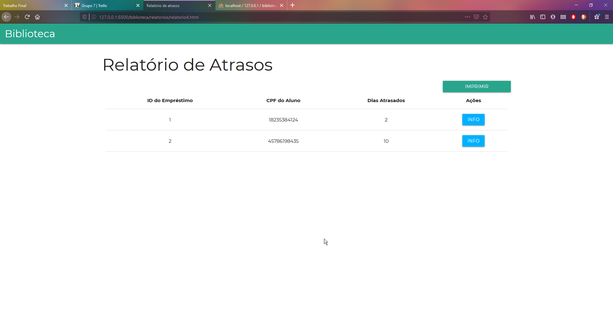

# Trabalho Final

%%%

## Semana 4

---

## Grupo 1|B

---

## O que foi proposto

%%%

- ✅ **Perfil** do professor _Aplicação Web_

- ❌ **Listagem** do acervo _Aplicação Desktop_ - ✅ **Consulta** de dados - ✅ **Inserção** de dados - ✅ **Remoção** de dados - ❌ **Edição** de dados

---

## O que foi feito

%%%

### Indra e Amanda

- **Consulta** de dados **acervo** em _Aplicação Desktop_
- **Inserção** de dados **acervo** em _Aplicação Desktop_
- **Remoção** de dados **acervo** em _Aplicação Desktop_

%%%

### Jonata

- **Perfil** do professor _Aplicação Web_
- **Adaptação back-end** para funcionamento do perfil
- **Refatoração** do código no back-end

%%%

### Nikolas

- **Conserto** de erros na **listagem** dos professores _Aplicação Desktop_
- **Refatoração** do código para seguir o padrão

---

## O que vai ser feito

%%%

- **Revisar** todo o nosso trabalho

- **Ajudar** outros grupos que estejam atrasados

- **Polir** detalhes, caso haja tempo

---

## Grupo 2|C

---

## O que proposto

%%%

### Front-end Aplicação Web

- ✔️ Finalizar Manutenção de Empréstimos
- ✔️ Finalizar Manutenção de Acervos

%%%

### Front-end Aplicação Desktop

- ✔️ Finalizar Manutenção Empréstimos
- ❌ Finalizar Manutenção de Acervos

---

## O que foi feito

%%%

#### Front-End Aplicação Web

Descobrimos na Segunda-Feira a existência de uma nova tabela que teremos que manipular. Assim, temos que finalizá-la

%%%

#### Back-end

Mesma situação do Front-end, porém já foi feito o back-end da tabela

%%%

#### Front-end Aplicação Desktop

Devido a dificuldades e muitos erros ao longo do caminho, não conseguimos finalizar a Aplicação Desktop toda.

---

### O que será feito

%%%

#### Front-end Aplicação Web

- Finalizar Manutenção Disciplinas-professores

%%%

#### Front-end Aplicação Desktop

- Finalizar Manutenção de Reservas

---

## Grupo 3|D

---

## O que foi proposto

- Sistema acadêmico: finalizar a Manutenção de Etapas na Aplicação Desktop
- Biblioteca: fazer os relatórios na Aplicação Desktop

---

## O que foi feito

%%%

#### Matheus

- Correção de erros de estilização da Aplicação Web
- Correção de erros nas funcionalidades da Aplicação Web

---

#### Arthur

- Busca por um meio de realizar a impressão dos relatórios

---

#### Enzo e Iago

- Finalização da Manutenção de Etapas na Aplicação Desktop
- Relatório de acervo da Aplicação Desktop

---

## O que faremos na próxima semana

- Terminar os relatórios da Aplicação Desktop

---

## Grupo 4|E

---

## O Que Foi Proposto

%%%

#### Aplicação Web

- ✅ Lançamento de Notas por Atividade
- ✅ Lançamento de Faltas por Atividade
- ❌ Diário do Aluno

%%%

#### Aplicação Desktop

- ✅ Finalizar Front-End do Diário
- ✅ Finalizar Front-End de Descartes

---

## O Que Fizemos

%%%

#### Marcus

- Front-End completo do Diário na Aplicação Desktop

#### Dornelas

- Back-End da Aplicação Desktop

%%%

#### Juan

- Lançamentos de notas e faltas

#### Nicoly e Julia

- Correções de código
- Front-End do Professor
- Front-End do Aluno

---

## O Que Faremos

%%%

#### Aplicação Web

- Autenticação do Diário do Professor
- Diário do Aluno

#### Aplicação Desktop

- Finalizar Back-End do Diário

---

## Grupo 5|F

---

## O que foi proposto

- ✅ Relatórios 8 e 9

- ✅ Manutenção de alunos (biblioteca)

- ✅ Finalizar as manutenções na Aplicação Desktop

---

## O que foi feito

#### Pedro Augusto

- Manutenção de alunos (biblioteca)
- Manutenção de campi (biblioteca)
- Aperfeiçoamento do front-end da Aplicação Web

---

#### Henrique e Osmar

- Relatório 8
- Relatório 9

---

#### Lucca e Maria Luiza

- Finalização das manutenções na Aplicação Desktop
- Implementação das manutenções no sistema Biblioteca

---

## O que faremos na próxima semana

- Terminar os relatórios na Aplicação Desktop
- Corrigir erros

---

## Grupo 6|G

---

## Aplicação Desktop

%%%

### O que foi proposto

- Aprimoramento da manutenção de departamentos
- Realização da transferência do aluno
- Liberação do histórico

---

### O que foi feito

- Aprimoramento da manutenção de departamentos
- Realização da transferência do aluno

---

### O que será feito

- Liberação do histórico

---

## Aplicação Web

%%%

### O que foi proposto

- Aprimoramento da página dos departamentos
- Exibição do histórico

---

### O que foi feito

%%%

#### Manutenção de departamentos

- Padronização do layout da página web
- Aperfeiçoamento do servidor
  - Segurança
  - Estrutura

%%%

#### Transferência de aluno

- Pequenas correções no servidor
- Aperfeiçoamento da página web

---

### O que será feito

- Aperfeiçoamento da página dos departamentos
- Liberação do histórico

---

## Grupo 7|H

---

## O que foi proposto

%%%

### Aplicação Web

- ✔️ Finalizar relatórios 4, 5 e 6 do sistema de biblioteca

%%%

### Aplicação Desktop

- ❌ Finalizar relatórios 4, 5 e 6 do sistema de biblioteca

---

## O que foi feito

%%%

### Aplicação Web

%%%

- Finalização dos relatórios 4, 5 e 6, seguindo os estilos padronizados
- Correções pedidas pela gerência em relação às requisições

%%%

#### Guilherme

Estilização completa da página, seguindo o padrão definido no Figma

%%%

#### Arthur

Requisições ao servidor e funcionalidade/dinamicidade da página

%%%

%%%

%%%

### Aplicação Desktop

%%%

#### Ruan

- Correções na parte de Manutenção de Cursos
  - Estilização
  - Verificação de preenchimento de campo
- Suporte a outros grupos mais atrasados

%%%

%%%

#### Samuel

- Relatórios 4, 5 e 6, com impressão na tela

%%%

---

## O que será feito

%%%

### Aplicação Desktop

%%%

Impressão (física, pdf) dos relatórios.

---

## Grupo 8|I

---

## O que era pra ter sido feito

%%%

- ✅ Terminar relatórios 10 e 11
- ✅ Padronizar CSS da Manutenção de Turmas na Aplicação Web
- ✅ Finalizar Manutenção de Turmas na Aplicação Desktop
- ❌ Comunicação do menu de relatórios com os relatórios
- ❌ Manutenção de matrículas

---

## O que foi feito

---

#### Aplicação Web

- CSS da Manutenção de Turmas (Raquel)
- Relatórios 10 e 11 (Vítor)
  - Falta poder imprimir

---

#### Aplicação Desktop

- Front-end e back-end da Manutenção de Turmas (Pedro Henrique e Isadora)
- Relatórios 10 e 11 (Pedro Henrique)
  - Falta poder imprimir

---

## O que iremos fazer

- Comunicação do menu de relatórios com os relatórios
- Impressão dos relatórios
- Manutenção de matrículas

---

## Grupo 0|A

---

## O que foi proposto

%%%

- ✅ Ajudar os grupos com dúvidas e problemas
- ✅ Criar as páginas de transições nas Aplicações
- ❌ Fazer a integração dos códigos nas Aplicações
- ✅ Resolver problemas no servidor
- ❌ Realocar integrantes

---

## O que foi feito

%%%

### Daniel

- Correções no servidor
- Solução de problemas encontrados na integração
- Ajuda aos demais grupos

---

### Wagner

- Criação das páginas de transições na Aplicação Web
- Integração da Aplicação Web
- Ajuda aos demais grupos

---

### Thiago

- Criação das páginas de transições na Aplicação Web
- Integração da Aplicação Desktop
- Ajuda aos demais grupos

---

## DEMO
